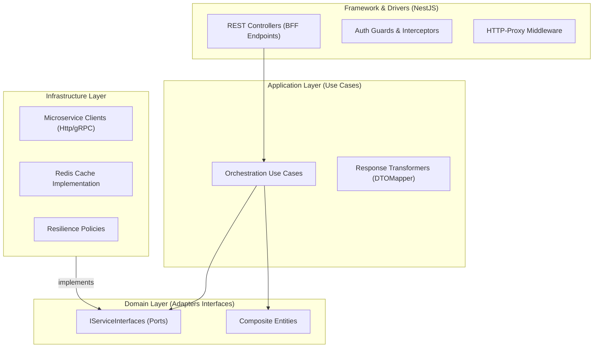

# Estrutura de Pastas e Arquitetura (API Gateway / BFF)

## Visão Geral
O API Gateway segue a **Clean Architecture** para garantir que a lógica de orquestração (Use Cases) não fique acoplada à forma como nos comunicamos com os microserviços (HTTP/gRPC/Kafka).

### Diagrama de Camadas



### Estrutura de Diretórios

A estrutura foca em módulos por funcionalidade do BFF (ex: Dashboard), não necessariamente espelhando 1:1 os microserviços.

```text
/src
├── /app                   # Configuração do NestJS (Modules, Middlewares)
├── /core                  # CAMADA DE DOMÍNIO DO BFF
│   ├── /domain
│   │   ├── /aggregates    # Objetos compostos (ex: DashboardData)
│   │   ├── /value-objects # VOs de apresentação (ex: FormattedCurrency)
│   │   └── /ports         # Interfaces para chamar microserviços (IServiceAdapter)
│   └── /use-cases         # Lógica de Agregação (ex: GetDashboardOverview)
├── /infra                 # IMPLEMENTAÇÃO TÉCNICA
│   ├── /http-client       # Configuração do Axios/gRPC
│   ├── /adapters          # Implementação dos Ports (ex: WorkOrderServiceAdapter)
│   ├── /cache             # Estratégias de Cache (Redis)
│   └── /observability     # Logging e Tracing (OpenTelemetry)
└── /interfaces            # PONTOS DE ENTRADA
    ├── /rest              # Controllers HTTP
    ├── /graphql           # Resolvers (se houver)
    └── /websockets        # Gateways para Realtime

```
