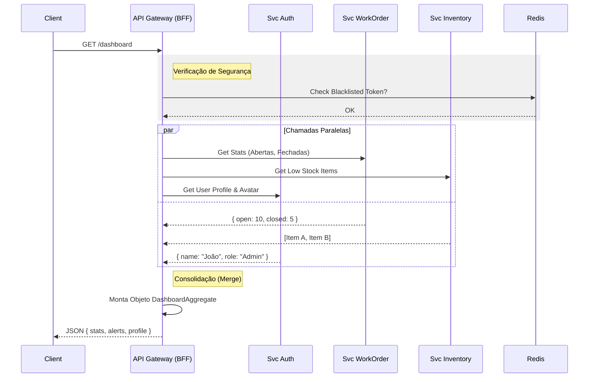
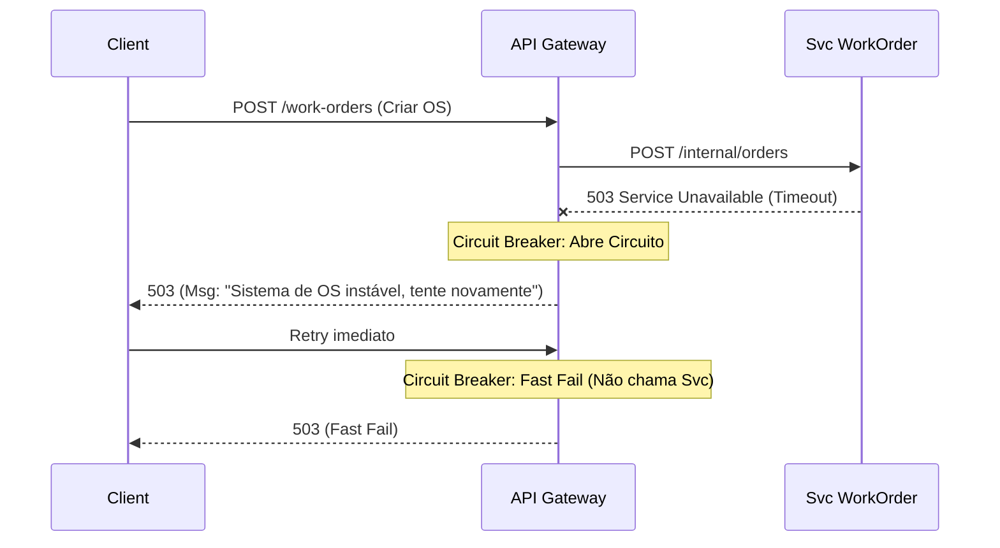

# Fluxos Principais (Orquestração)

## Fluxo 1: Agregação de Dashboard (BFF Pattern)
Este fluxo mostra como o Gateway chama múltiplos serviços em paralelo para montar uma resposta rápida.

## Fluxo 2: Ingestão de Comando com Falha (Circuit Breaker)

Como o Gateway lida quando um microserviço está fora do ar.

