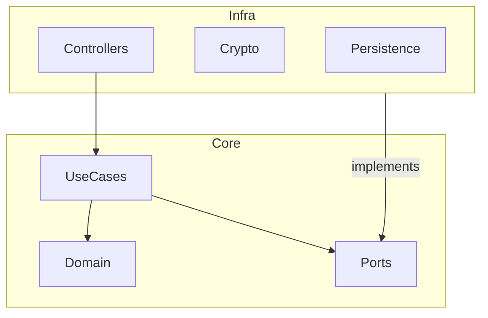

# Architecture - svc-auth

## 1. System Overview
The `svc-auth` is a critical microservice responsible for Identity and Access Management (IAM), multi-tenancy, and security.

## 2. Layers Detail

### Core (Domain & Application)
* **Domain:** Contains the "heart" of the system (Entities, VOs, Domain Events).
* **Ports:** Interface definitions for repositories and external services.
* **Application:** Orchestrates use cases.

### Infrastructure (Adapters)
* **Database:** TypeORM/Prisma implementations for PostgreSQL.
* **Cryptography:** Concrete implementations for Hashing and JWT.
* **API:** NestJS Controllers for REST and gRPC endpoints.
* **Messaging:** Kafka producers for domain events.

## 3. Directory Structure
```text
/src
├── /core                  # Framework Independent
│   ├── /domain
│   │   ├── /entities      # User, Tenant, Role
│   │   ├── /value-objects # Email, Password, CNPJ
│   │   ├── /events        # UserRegisteredEvent
│   │   └── /exceptions    # Domain Errors
│   ├── /ports             # Interfaces
│   └── /application       # Use Cases
├── /infra                 # Adapters (NestJS)
│   ├── /database          # Repositories & Mappers
│   ├── /cryptography      # Bcrypt, JWT Strategy
│   ├── /messaging         # Kafka Implementation
│   └── /api               # Controllers (REST/gRPC)
└── /main.ts               # Entry Point
```

## 4. Key Diagrams

### Dependency Graph

