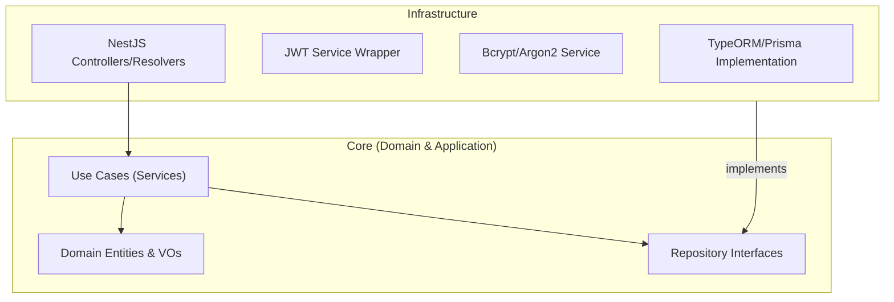

# Estrutura de Pastas e Arquitetura (svc-auth)

## Visão Geral
Este microserviço é crítico e isolado. Ele segue estritamente a **Clean Architecture** para garantir que a lógica de criptografia, geração de tokens e regras de acesso não se misturem com frameworks de banco de dados ou HTTP.

### Diagrama de Dependência



### Estrutura de Diretórios

```text
/src
├── /core                  # INDEPENDENTE DE FRAMEWORK
│   ├── /domain
│   │   ├── /entities      # User, Tenant, Role
│   │   ├── /value-objects # Email, Password (hash logic), CNPJ
│   │   ├── /events        # UserRegisteredEvent, TenantCreatedEvent
│   │   └── /exceptions    # Erros de Domínio (ex: InvalidPasswordError)
│   ├── /ports             # Interfaces (IUserRepository, IEncrypter)
│   └── /application       # Casos de Uso (Use Cases)
│       ├── /auth          # Login, RefreshToken, ForgotPassword
│       ├── /user          # CreateUser, UpdateProfile
│       └── /tenant        # CreateTenant, InviteUser
├── /infra                 # CAMADA DE ADAPTADORES (NestJS)
│   ├── /database          # Repositórios concretos (Postgres)
│   │   ├── /mappers       # ORM Entity <-> Domain Entity
│   │   └── /repositories  # TypeOrmUserRepository
│   ├── /cryptography      # Implementação Bcrypt, JWT Strategy
│   ├── /messaging         # Kafka Producer implementation
│   └── /api               # Controllers (HTTP/REST) e gRPC
└── /main.ts               # Entry Point

```
