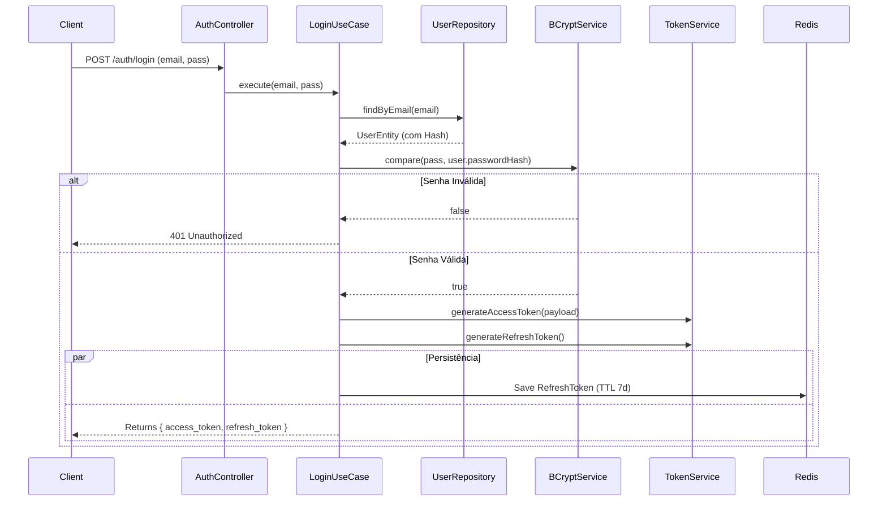
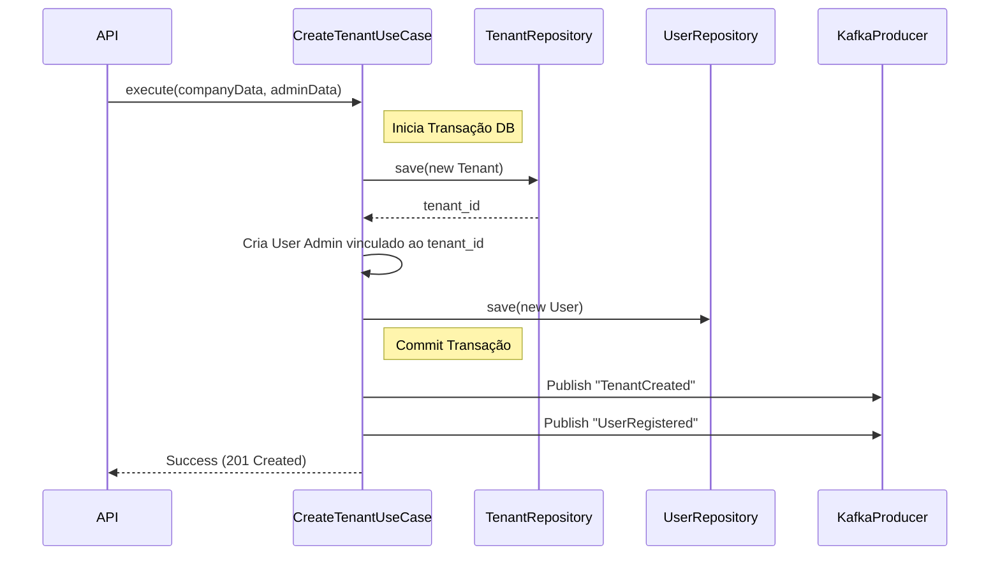

# Fluxos Principais

## Fluxo 1: Autenticação (Login) com Refresh Token
Este fluxo garante segurança e renovação de sessão sem forçar logout constante.

## Fluxo 2: Criação de Tenant (Transacional)

Cria a organização e o primeiro usuário (Admin) atomicamente.

