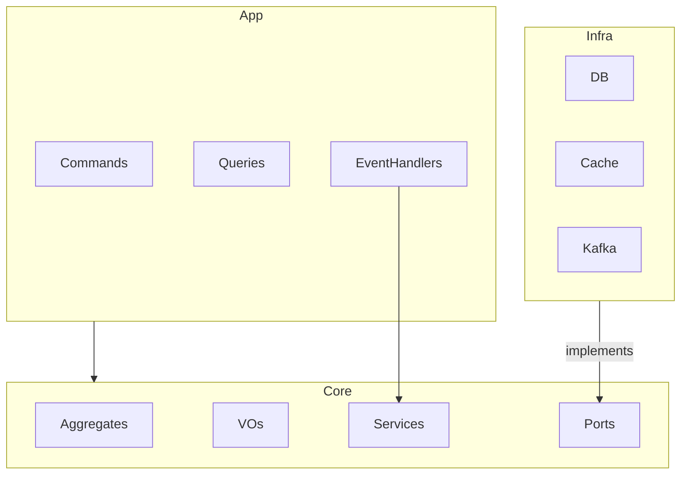

# Architecture - svc-inventory

## 1. System Overview
The `svc-inventory` is responsible for tracking parts and products, managing reservations based on work orders, and maintaining a full audit trail (Kardex).

## 2. Layers Detail

### Core Domain
* **Aggregates:** `Product` (Consistency boundary for stock levels).
* **Value Objects:** `SKU`, `Quantity`, `Dimensions`, `Money`.
* **Domain Services:** `StockReservationService`, `StockPolicy`.
* **Domain Events:** `LowStockDetected`, `PriceChanged`.

### Application Layer
* **Commands:** Adjust Stock, Register Product, Consume Stock, Reserve Stock.
* **Queries:** Get Product Availability, Stock Ledger (Kardex).
* **Event Handlers:** Consumes `WorkOrder.Approved`, `WorkOrder.Completed` from Kafka.

### Infrastructure Layer
* **Persistence:** PostgreSQL for transactional data.
* **Cache:** Redis for high-speed catalog read-projections.
* **API:** REST Controllers for management and manual adjustments.
* **Messaging:** Kafka consumers and producers.

## 3. Directory Structure
```text
/src
├── /core
│   ├── /domain
│   │   ├── /aggregates    # Product (Root)
│   │   ├── /entities      # Supplier, StockMovement
│   │   ├── /value-objects # SKU, Money, Quantity
│   │   ├── /events        # LowStockDetected
│   │   └── /services      # Domain Logic
│   ├── /ports             # IProductRepository, etc.
│   └── /application
│       ├── /commands      # AdjustStock, ConsumeStock
│       └── /queries       # GetProductAvailability
├── /infra
│   ├── /database          # TypeORM/Prisma Implementation
│   ├── /api               # REST Controllers
│   └── /messaging         # Kafka Consumers
└── /workers               # Background Jobs
```

## 4. Layer Interaction

