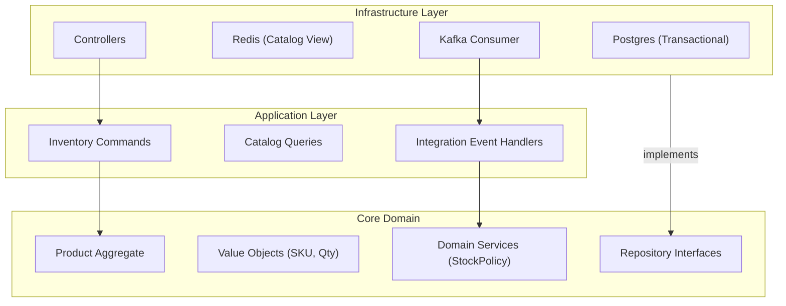

# Estrutura de Pastas e Arquitetura (svc-inventory)

## Visão Geral
O serviço de estoque é focado em **Integridade de Dados** e **Controle de Concorrência**. A arquitetura deve prevenir "overselling" (vender o que não tem) e garantir rastreabilidade total (audit trail) de cada parafuso que entra ou sai.

### Diagrama de Camadas



### Estrutura de Diretórios

```text
/src
├── /core                  # LÓGICA DE NEGÓCIO
│   ├── /domain
│   │   ├── /aggregates    # Product (Raiz)
│   │   ├── /entities      # Supplier, StockMovement
│   │   ├── /value-objects # SKU, Money, Quantity
│   │   ├── /events        # LowStockDetected, StockAdjusted
│   │   └── /services      # StockReservationService
│   ├── /ports             # IProductRepository, ISupplierRepository
│   └── /application       # Use Cases
│       ├── /commands      # AdjustStock, RegisterProduct, ConsumeStock
│       └── /queries       # GetProductAvailability
├── /infra                 # IMPLEMENTAÇÃO
│   ├── /database          # TypeORM/Prisma
│   ├── /api               # REST (Gerenciamento)
│   └── /messaging         # Consumers (WorkOrderEvents)
└── /workers               # Jobs (ex: Relatório de Giro de Estoque)

```
