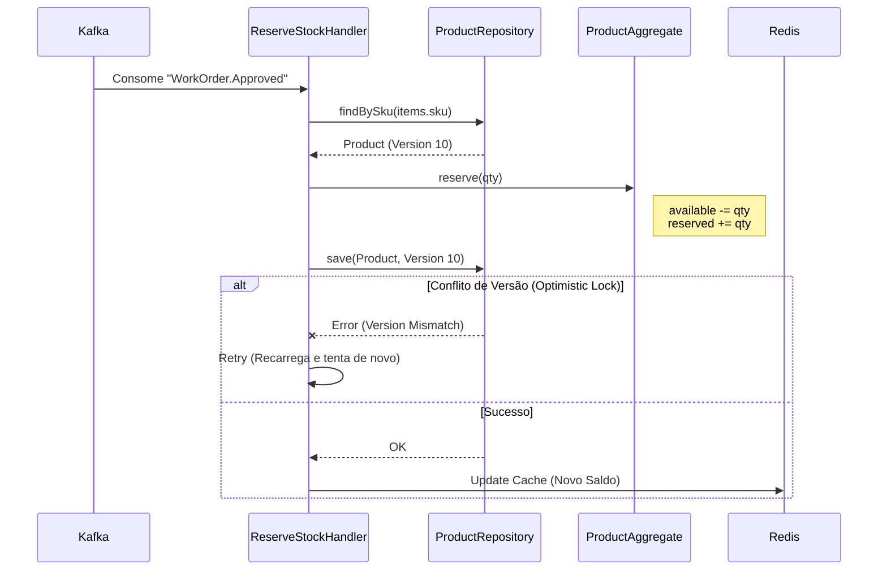
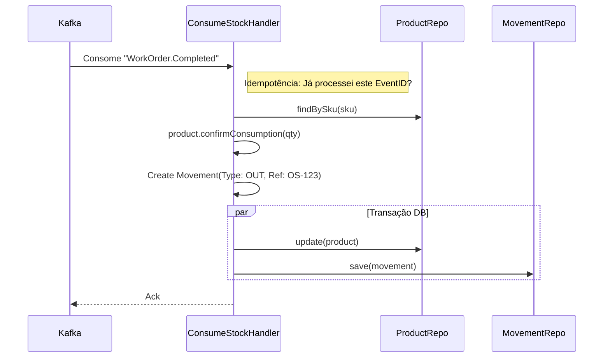

# Fluxos Principais

## Fluxo 1: Reserva de Estoque (Reativo a Evento)
Ocorre quando o cliente aprova o orçamento no `svc-work-order`. O estoque deve ser "segurado".

## Fluxo 2: Baixa Definitiva (Consumo)

Ocorre quando a O.S. é finalizada. Move de "Reservado" para "Baixado" e gera log de movimento.

