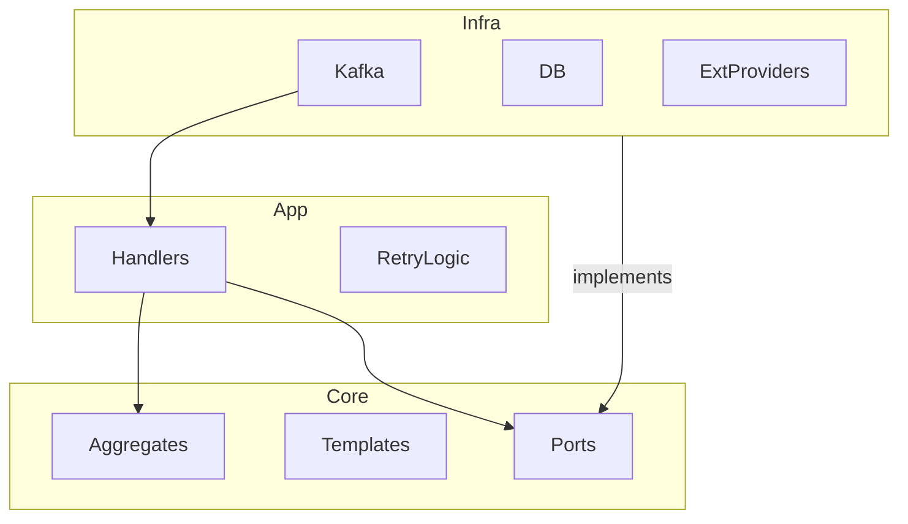

# Architecture - svc-notification

## 1. System Overview
Centralized communication service that isolates other microservices from the complexity of third-party APIs (SendGrid, Twilio, Firebase) and template management.

## 2. Layers Detail

### Core Domain
* **Aggregates:** `Notification` (Main record for logs and status).
* **Entities:** `MessageTemplate`.
* **Value Objects:** `EmailAddress`, `PhoneNumber`, `Priority`, `Content` (Subject/Body).
* **Domain Services:** `TemplateEngine` (compiling variables), `ProviderSelector` (fallback logic).

### Application Layer
* **Handlers:** Event-specific use cases (e.g., `SendWelcomeEmail`, `NotifyOrderStatus`).
* **Commands:** `SendGenericNotification`.
* **Policies:** Retry and Backoff logic.

### Infrastructure Layer
* **Messaging:** Kafka Consumer (listening to `auth.*`, `work-order.*`).
* **Database:** PostgreSQL for notification logs and history.
* **Providers (Adapters):** Concrete implementations for AWS SES, Twilio, Firebase.

## 3. Directory Structure
```text
/src
├── /core
│   ├── /domain
│   │   ├── /aggregates    # Notification log & status
│   │   ├── /entities      # MessageTemplate
│   │   ├── /value-objects # Email, Phone, Priority
│   │   └── /services      # TemplateCompiler service
│   ├── /ports             # IEmailProvider, ISmsProvider, etc.
│   └── /application
│       ├── /handlers      # Use cases (SendWelcomeEmail)
│       └── /commands      # SendGenericNotification
├── /infra
│   ├── /database          # History repository
│   ├── /messaging         # Kafka Consumers
│   └── /providers         # Adapters (SES, Twilio)
└── /config                # Event -> Template mapping
```

## 4. Communication Flow

