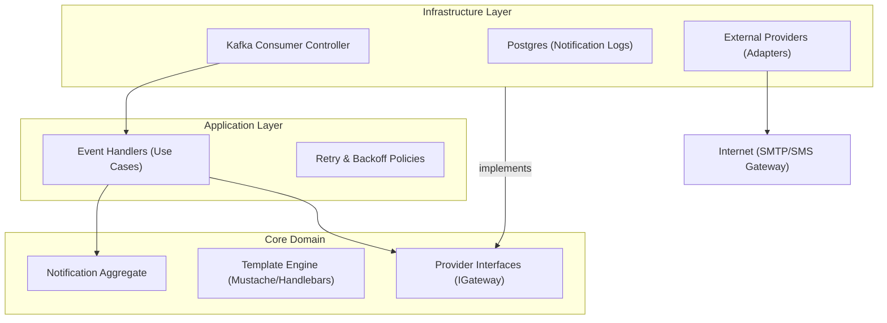

# Estrutura de Pastas e Arquitetura (svc-notification)

## Visão Geral
Este serviço centraliza a lógica de comunicação. Ele isola os outros microserviços da complexidade de lidar com APIs de terceiros (SendGrid, Twilio, Firebase) e gestão de templates. Segue **Clean Architecture** para permitir a troca fácil de provedores (ex: mudar de AWS SES para Mailgun sem afetar o código de negócio).

### Diagrama de Componentes



### Estrutura de Diretórios

```text
/src
├── /core                  # INDEPENDENTE DE FRAMEWORK
│   ├── /domain
│   │   ├── /aggregates    # Notification (Log & Status)
│   │   ├── /entities      # MessageTemplate
│   │   ├── /value-objects # EmailAddress, PhoneNumber, Priority
│   │   └── /services      # TemplateCompiler (Parser de variaveis)
│   ├── /ports             # IEmailProvider, ISmsProvider, INotificationRepository
│   └── /application       # Casos de Uso
│       ├── /handlers      # SendWelcomeEmail, NotifyOrderStatus
│       └── /commands      # SendGenericNotification
├── /infra                 # ADAPTADORES
│   ├── /database          # Repositório de Logs (Audit)
│   ├── /messaging         # Kafka Consumers (Topics: auth.*, work-order.*)
│   └── /providers         # Implementação concreta
│       ├── /aws-ses       # Adapter para Amazon SES
│       ├── /twilio        # Adapter para SMS/WhatsApp
│       └── /firebase      # Adapter para Push Notifications
└── /config                # Mapeamento Evento -> Template

```
