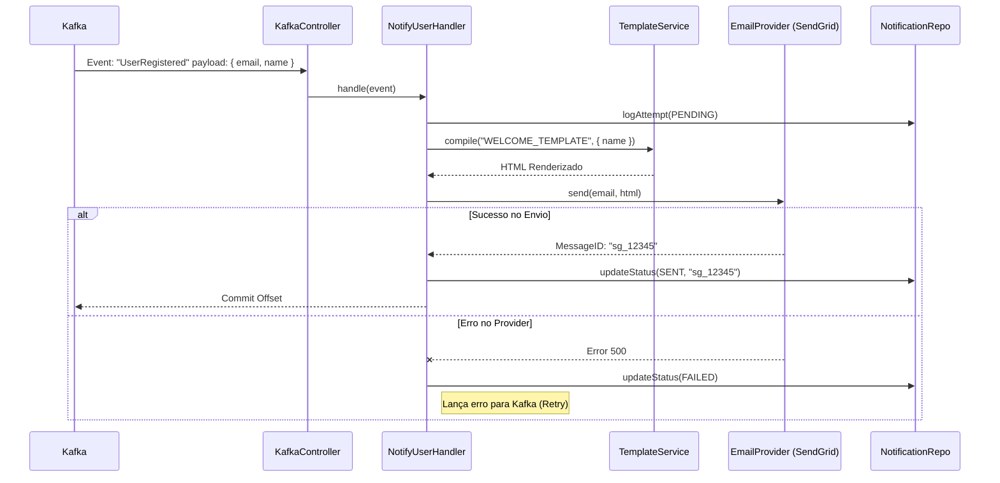
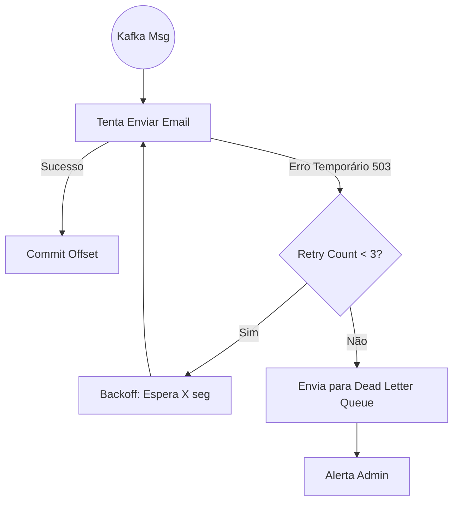

# Fluxos Principais

## Fluxo 1: Consumo de Evento e Envio (Happy Path)
O fluxo padrão onde um evento de negócio dispara uma notificação.

## Fluxo 2: Retry Pattern (Resiliência)

Como o sistema lida com instabilidades no provedor de email.

