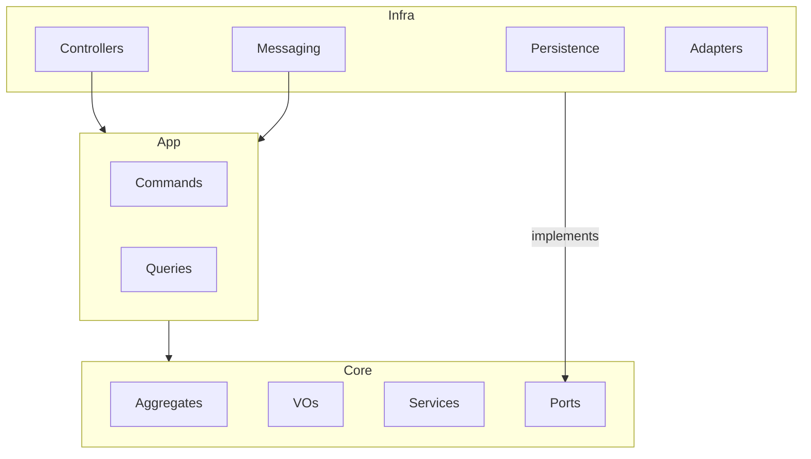

# Architecture - svc-work-order

## 1. System Overview
The `svc-work-order` manages the lifecycle of Work Orders (O.S.), coordinating calculations, status changes, and integration with inventory and finance.

## 2. Layers Detail

### Core (Domain & Application)
* **Domain Aggregates:** `WorkOrder` (Root entity for transactional consistency).
* **Entities:** `OrderItem`, `PartItem`, `ServiceItem`.
* **Value Objects:** `Money`, `WorkOrderStatus`, `VehicleSnapshot`, `CustomerSnapshot`.
* **Domain Services:** `TaxCalculator`, `ProfitMarginService`.
* **Ports:** Interfaces for data access and external gateways.
* **Application:** Use cases for commands (actions) and queries (lookups).

### Infrastructure
* **Database:** PostgreSQL for relational data and `outbox` table.
* **API:** NestJS Controllers (REST).
* **Messaging:** Kafka controllers for listening to events and publishers for integration events.
* **Adapters:** ACL implementations for communication with `svc-inventory`, `svc-customer`, etc.

## 3. Directory Structure
```text
/src
├── /core                  # Business Logic (Framework Independent)
│   ├── /domain
│   │   ├── /aggregates    # WorkOrder (Root)
│   │   ├── /entities      # OrderItem, PartItem, ServiceItem
│   │   ├── /value-objects # Money, WorkOrderStatus, VehicleSnapshot
│   │   ├── /events        # ItemAdded, OrderFinished
│   │   └── /services      # TaxCalculator
│   ├── /ports             # IWorkOrderRepository, IInventoryGateway
│   └── /application       # Use Cases (Commands/Queries)
├── /infra                 # Technical Implementation (NestJS)
│   ├── /database          # TypeORM Entities & Repositories
│   ├── /http              # REST Controllers
│   ├── /messaging         # Kafka Listeners
│   └── /adapters          # Outbound Adaptors (ACLs)
└── /shared                # Utilities
```

## 4. Interaction Diagram

