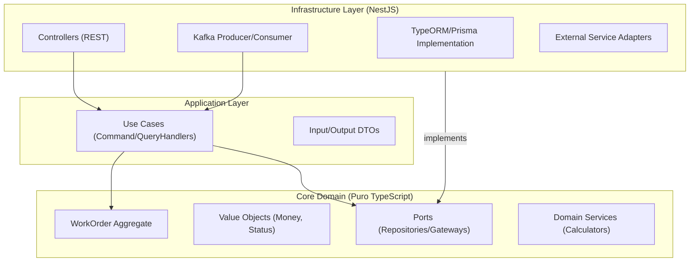

# Estrutura de Pastas e Arquitetura (svc-work-order)

## Visão Geral
Este serviço gerencia o ciclo de vida das Ordens de Serviço. Devido à alta complexidade de estados e cálculos financeiros, aplicamos **Clean Architecture** rigorosa para isolar as regras de negócio de frameworks e bibliotecas externas.

### Diagrama de Componentes



### Estrutura de Diretórios

Separamos claramente o que é Regra de Negócio (Core) do que é "Mecanismo de Entrega" (Infra).

```text
/src
├── /core                  # DOMÍNIO E APLICAÇÃO (Agnóstico ao NestJS)
│   ├── /domain
│   │   ├── /aggregates    # WorkOrder (Raiz)
│   │   ├── /entities      # OrderItem, PartItem, ServiceItem
│   │   ├── /value-objects # Money, WorkOrderStatus, VehicleSnapshot
│   │   ├── /events        # Domain Events (ex: ItemAdded)
│   │   └── /services      # Domain Services (ex: TaxCalculator)
│   ├── /ports             # Interfaces (IWorkOrderRepository, IInventoryGateway)
│   └── /application       # Use Cases
│       ├── /commands      # CreateWorkOrder, AddItem, ApproveOrder
│       └── /queries       # GetWorkOrderById, ListOrdersByStatus
├── /infra                 # IMPLEMENTAÇÃO TÉCNICA
│   ├── /database          # TypeORM Entities & Repositories
│   ├── /http              # Controllers REST
│   ├── /messaging         # Kafka Controllers (Listeners)
│   └── /adapters          # Comunicação com outros MS (Inventory, Customer)
└── /shared                # Utilitários

```
