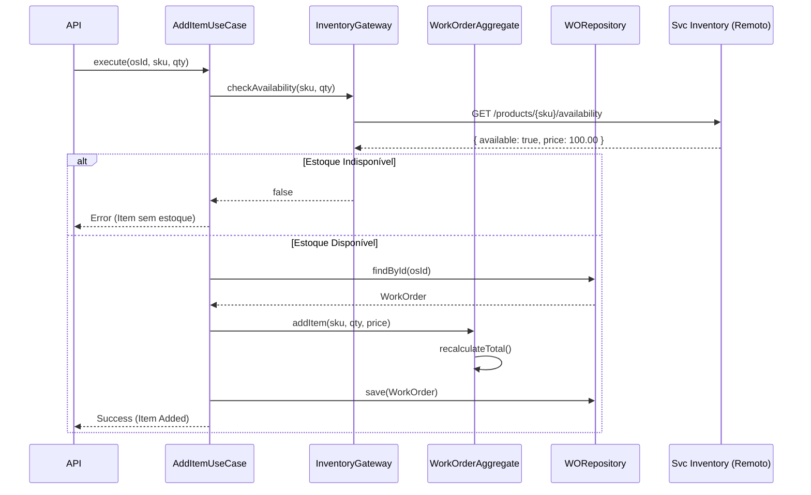
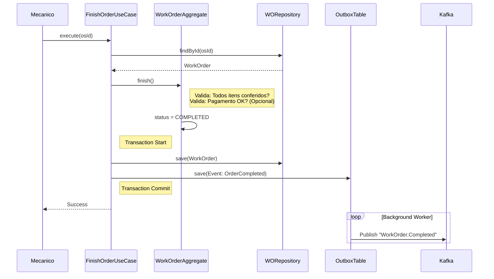

# Fluxos Principais

## Fluxo 1: Adição de Item com Validação de Estoque (Síncrono)
Embora a baixa de estoque seja assíncrona na finalização, a verificação de disponibilidade deve ser síncrona no orçamento para evitar vender o que não tem.

## Fluxo 2: Finalização da Ordem de Serviço (Core Event Driven)

Este é o fluxo mais crítico, pois dispara efeitos colaterais em outros serviços.

