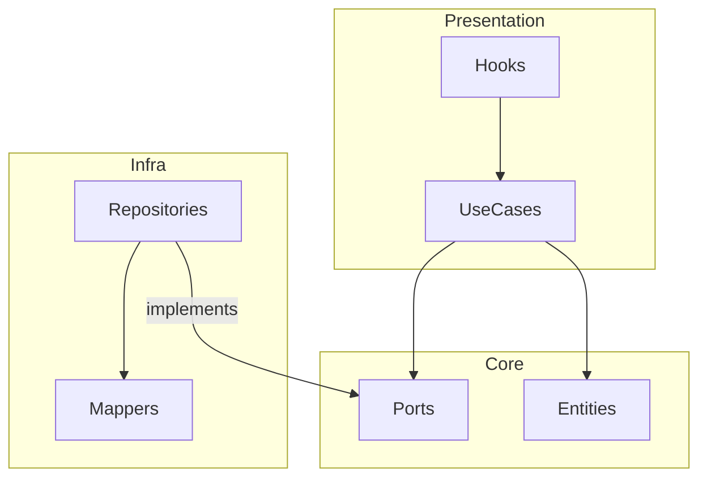

# Architecture - web-portal

## 1. System Overview
The `web-portal` is a Next.js application designed with Clean Architecture to ensure business logic is decoupled from UI frameworks and infrastructure.

## 2. Layers Detail

### Presentation Layer (UI)
* **App Router:** Next.js routes and entry points.
* **Components:** Project-specific React components.
* **Hooks:** Act as controllers/presenters, bridging the UI and Use Cases.
* **Contexts:** Global state management (Auth, Theme).

### Core Layer (Domain)
* **Entities:** Rich objects with business logic (e.g., `WorkOrder`).
* **Value Objects:** Immutable objects with validation (e.g., `Money`, `CPF`).
* **Use Cases:** Orchestrate domain logic (e.g., `CreateWorkOrder`).
* **Ports:** Interfaces for repositories and gateways.

### Infrastructure Layer
* **HTTP:** Axios client, interceptors, and DTO definitions.
* **Repositories:** Concrete implementations using the HTTP client.
* **Mappers:** Translation between API DTOs and Domain Entities.

### Design System
* **Atomic Design:** UI component library (`atoms`, `molecules`, `organisms`).

## 3. Directory Structure
```text
/src
├── /app                   # Next.js App Router (Routes)
├── /core                  # PURE DOMAIN (No React/Next dependencies)
│   ├── /domain            # Entities, VOs, Events
│   ├── /use-cases         # Business Rules
│   └── /repositories      # Repository Interfaces
├── /infra                 # TECHNICAL IMPLEMENTATION
│   ├── /http              # Axios Client & DTOs
│   ├── /repositories      # Concrete implementations
│   └── /mappers           # Data Mappers (JSON <-> Entity)
├── /presentation          # VISUAL LAYER (React)
│   ├── /components        # Composed components
│   ├── /hooks             # Controllers/Presenters
│   ├── /contexts          # Global State
│   └── /view-models       # View-specific models
└── /design-system         # ATOMIC UI COMPONENTS
    ├── /atoms
    ├── /molecules
    └── /organisms
```

## 4. Layer Interaction

