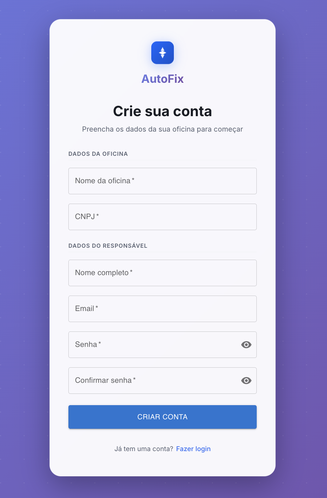

# AutoFix Web Portal

Portal web do sistema AutoFix desenvolvido com Next.js, TypeScript e Clean Architecture.

## 🏗️ Arquitetura

Este projeto segue os princípios da **Clean Architecture** adaptados para o ecossistema React/Next.js:

- **Presentation Layer**: Componentes React, Hooks e Páginas Next.js
- **Core Layer**: Entidades, Value Objects, Use Cases e Ports (interfaces)
- **Infrastructure Layer**: Implementações concretas (HTTP Client, Repositories, Mappers)
- **Design System**: Biblioteca de componentes UI baseada em Atomic Design

## 🚀 Tecnologias

- **Framework**: Next.js 15 (App Router)
- **Linguagem**: TypeScript
- **HTTP Client**: Axios
- **Estilização**: CSS Modules
- **Testes**: Jest + ts-jest
- **Linting**: ESLint

## 📁 Estrutura de Diretórios

```
/src
├── /app                   # Next.js App Router (Routes)
├── /core                  # PURE DOMAIN (No React/Next dependencies)
│   ├── /domain            # Entities, VOs, Events
│   ├── /use-cases         # Business Rules
│   └── /repositories      # Repository Interfaces
├── /infra                 # TECHNICAL IMPLEMENTATION
│   ├── /http              # Axios Client & DTOs
│   ├── /repositories      # Concrete implementations
│   └── /mappers           # Data Mappers (JSON <-> Entity)
├── /presentation          # VISUAL LAYER (React)
│   ├── /components        # Composed components
│   ├── /hooks             # Controllers/Presenters
│   ├── /contexts          # Global State
│   └── /view-models       # View-specific models
└── /design-system         # ATOMIC UI COMPONENTS
    ├── /atoms
    ├── /molecules
    └── /organisms
```

## 🎨 Design System

O Design System segue o padrão **Atomic Design**:

- **Atoms**: Componentes básicos (Button, Input, Label)
- **Molecules**: Combinações simples (FormField, Card)
- **Organisms**: Componentes complexos (Header, Sidebar, Table)

### Tokens de Design

Todos os tokens de design (cores, tipografia, espaçamento, etc.) estão centralizados em `src/design-system/tokens.css`.

## 🧪 Testes

```bash
# Executar todos os testes
npm test

# Executar testes em modo watch
npm run test:watch
```

## 🏃 Como Executar

1. Instalar dependências:
```bash
npm install
```

2. Configurar variáveis de ambiente:
```bash
cp .env.example .env
```

3. Executar em modo desenvolvimento:
```bash
npm run dev
```

4. Acessar: http://localhost:3000

## 📦 Build

```bash
npm run build
npm start
```

## ♿ Acessibilidade

Este projeto segue as diretrizes **WCAG 2.1 AA**:

- Navegação completa por teclado
- ARIA labels em elementos interativos
- Gerenciamento de foco em modais
- Contraste de cores adequado

## 🔒 Segurança

- Tokens JWT armazenados em localStorage (considerar HttpOnly cookies em produção)
- Interceptors Axios para autenticação automática
- Validação de dados com Value Objects

## 📝 Convenções de Código

- **Componentes**: PascalCase (ex: `Button.tsx`)
- **Hooks**: camelCase com prefixo `use` (ex: `useWorkOrder.ts`)
- **Interfaces (Ports)**: Prefixo `I` (ex: `IWorkOrderRepository`)
- **Mappers**: Sufixo `Mapper` (ex: `WorkOrderMapper`)
- **Use Cases**: Sufixo `UseCase` (ex: `CreateWorkOrderUseCase`)

## 📚 Documentação Adicional

Consulte a pasta `docs/` para documentação detalhada sobre:

- Estrutura de pastas
- DDD e Clean Architecture
- Data Sources
- SEO e Acessibilidade
- Histórias de usuário
- Fluxos de frontend
