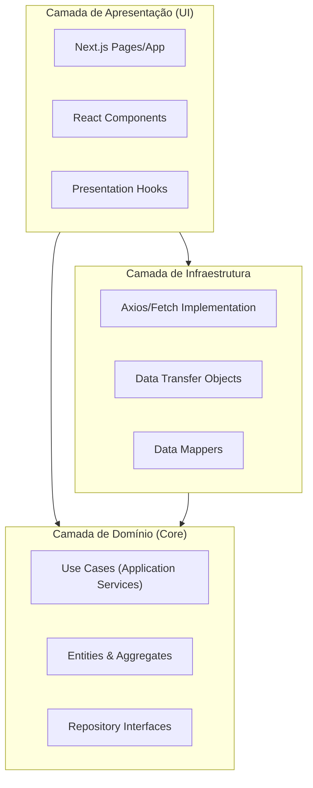

# Estrutura de Pastas e Arquitetura (Frontend)

## Visão Geral
A arquitetura do projeto `web-portal` segue os princípios da **Clean Architecture** adaptados para o ecossistema React/Next.js. O objetivo é desacoplar a regra de negócio (Domínio) da interface (UI) e da infraestrutura (API Clients).

### Diagrama de Camadas



### Estrutura de Diretórios
A estrutura reflete a separação de responsabilidades. O Design System é tratado como uma biblioteca de componentes "burros" (apresentacionais).

```text
/src
├── /app                   # (Next.js App Router) - Entry points e Roteamento
│   ├── (public)           # Rotas SSG (Landing Page, Blog)
│   └── (dashboard)        # Rotas Protegidas (SaaS)
├── /core                  # DOMÍNIO PURO (Sem dependência de React/Next)
│   ├── /domain
│   │   ├── /entities      # Classes de Entidade (ex: WorkOrder)
│   │   ├── /value-objects # Objetos de Valor (ex: Money, CPF)
│   │   └── /events        # Definição de Eventos de Domínio
│   ├── /use-cases         # Regras de Negócio (ex: CreateWorkOrder)
│   └── /repositories      # Interfaces (contratos) dos repositórios
├── /infra                 # IMPLEMENTAÇÃO TÉCNICA
│   ├── /http              # Cliente HTTP (Axios) e Interceptors
│   ├── /repositories      # Implementação concreta (ApiWorkOrderRepository)
│   └── /mappers           # Converte JSON da API <-> Entidades de Domínio
├── /presentation          # CAMADA VISUAL (React)
│   ├── /components        # Componentes compostos do projeto
│   ├── /hooks             # Custom Hooks (Controllers/Presenters)
│   ├── /contexts          # Global State (AuthContext, ThemeContext)
│   └── /view-models       # Modelos específicos para a View
└── /design-system         # COMPONENTES UI (Atomic Design)
    ├── /atoms             # Botões, Inputs, Labels
    ├── /molecules         # Form Fields, Cards simples
    └── /organisms         # Header, Sidebar, Tabelas complexas
````
