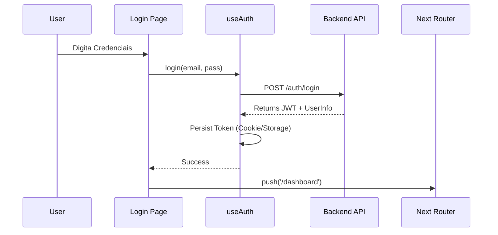
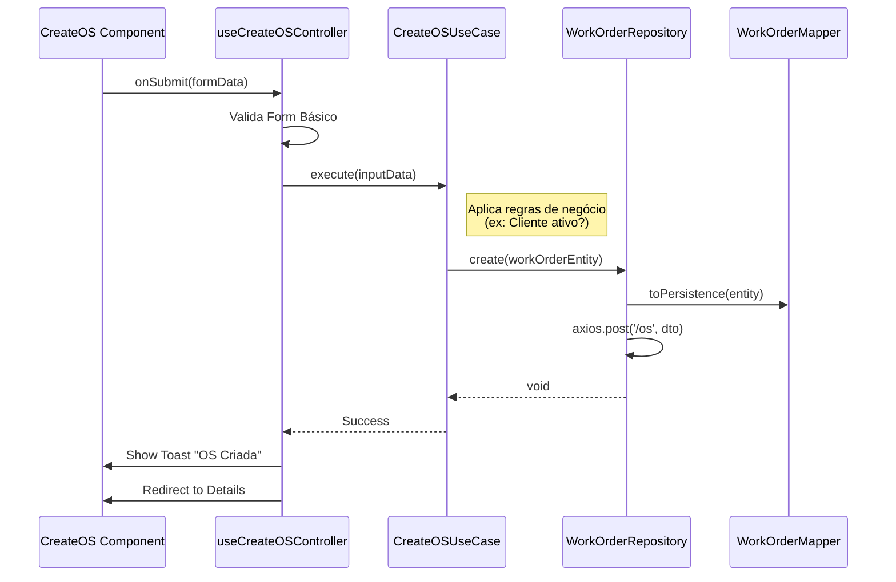

# Fluxos Principais

## Fluxo 1: Login e Hidratação de Sessão
Utiliza NextAuth ou gerenciamento manual de JWT com Context API.

## Fluxo 2: Criação de Ordem de Serviço (Clean Arch Flow)

Demonstra como a View interage com o Domínio.

