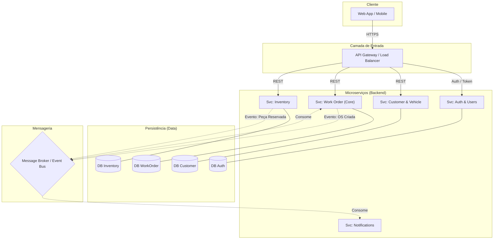

O erro de sintaxe no Mermaid geralmente ocorre quando utilizamos caracteres especiais (como `:`, `/`, `&` ou espaços) dentro dos rótulos sem o uso de aspas. Além disso, definir IDs para os subgráficos evita conflitos de renderização.

Aqui está o arquivo corrigido, com todos os textos entre aspas duplas e identificadores de subgráficos ajustados:

### 📂 File: `2_arquitetura_diagrama.md`

```markdown
# Diagrama de Arquitetura

A solução utiliza um **API Gateway** para rotear as requisições para os microserviços apropriados. A comunicação entre serviços para processos não bloqueantes (ex: baixar estoque ao finalizar O.S.) é feita via **Event Bus** (Kafka).



```

### Principais correções aplicadas:
1.  **Aspas nos Rótulos:** Adicionei aspas duplas `""` em todos os textos dos nós (ex: `["Web App / Mobile"]`) para que caracteres como `/` e `&` não quebrem o parser.
2.  **IDs nos Subgraphs:** Alterei `subgraph "Nome"` para `subgraph ID ["Nome"]` (ex: `subgraph ClientLayer ["Cliente"]`), o que é mais seguro para diferentes renderizadores de Mermaid.
3.  **Cilindros de Banco de Dados:** Garanti que o texto dentro da sintaxe do cilindro `[("Texto")]` também estivesse entre aspas.

### Próximo Passo
Gostaria de ver o diagrama de sequência do "Fluxo de Aprovação" também, para garantir que a lógica do Kafka está clara?

```
