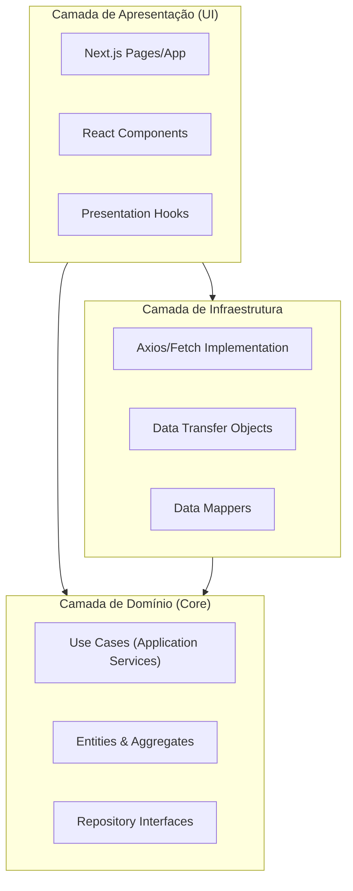
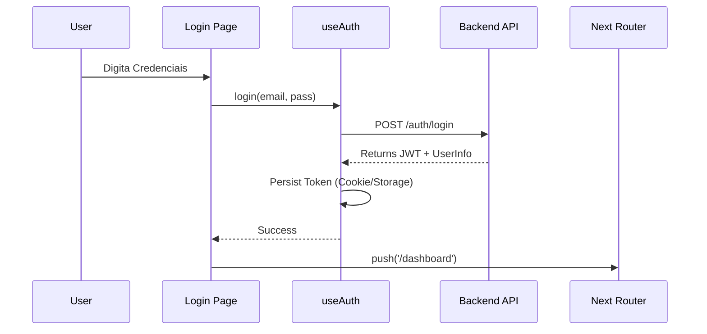
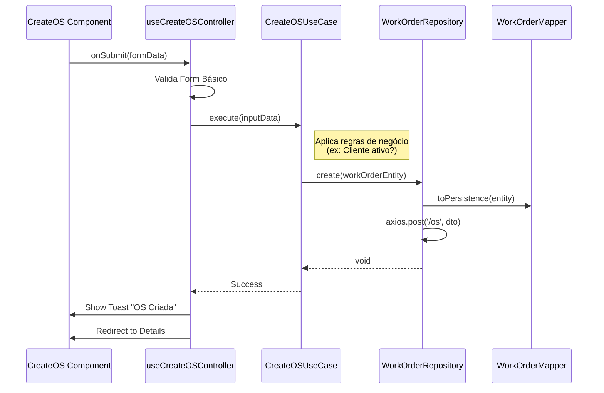

Aqui está a documentação de arquitetura detalhada para o aplicativo `web-portal`, focada na aplicação de Clean Architecture e DDD no frontend com Next.js.

---

### 📂 File: `1_estrutura_pastas.md`

```markdown
# Estrutura de Pastas e Arquitetura (Frontend)

## Visão Geral
A arquitetura do projeto `web-portal` segue os princípios da **Clean Architecture** adaptados para o ecossistema React/Next.js. O objetivo é desacoplar a regra de negócio (Domínio) da interface (UI) e da infraestrutura (API Clients).

### Diagrama de Camadas



### Estrutura de Diretórios

A estrutura reflete a separação de responsabilidades. O Design System é tratado como uma biblioteca de componentes "burros" (apresentacionais).

```text
/src
├── /app                   # (Next.js App Router) - Entry points e Roteamento
│   ├── (public)           # Rotas SSG (Landing Page, Blog)
│   └── (dashboard)        # Rotas Protegidas (SaaS)
├── /core                  # DOMÍNIO PURO (Sem dependência de React/Next)
│   ├── /domain
│   │   ├── /entities      # Classes de Entidade (ex: WorkOrder)
│   │   ├── /value-objects # Objetos de Valor (ex: Money, CPF)
│   │   └── /events        # Definição de Eventos de Domínio
│   ├── /use-cases         # Regras de Negócio (ex: CreateWorkOrder)
│   └── /repositories      # Interfaces (contratos) dos repositórios
├── /infra                 # IMPLEMENTAÇÃO TÉCNICA
│   ├── /http              # Cliente HTTP (Axios) e Interceptors
│   ├── /repositories      # Implementação concreta (ApiWorkOrderRepository)
│   └── /mappers           # Converte JSON da API <-> Entidades de Domínio
├── /presentation          # CAMADA VISUAL (React)
│   ├── /components        # Componentes compostos do projeto
│   ├── /hooks             # Custom Hooks (Controllers/Presenters)
│   ├── /contexts          # Global State (AuthContext, ThemeContext)
│   └── /view-models       # Modelos específicos para a View
└── /design-system         # COMPONENTES UI (Atomic Design)
    ├── /atoms             # Botões, Inputs, Labels
    ├── /molecules         # Form Fields, Cards simples
    └── /organisms         # Header, Sidebar, Tabelas complexas

```

```

---

### 📂 File: `2_ddd_clean_arch.md`

```markdown
# Domain Driven Design (DDD) & Elementos Táticos

Nesta arquitetura, o frontend não é apenas um "exibidor de JSON". Ele possui conhecimento rico sobre as regras de validação, estados e comportamentos das entidades antes mesmo de enviar dados ao backend.

## 1. Agregados (Aggregates)
São clusters de objetos de domínio que podem ser tratados como uma unidade única.

* **WorkOrderAggregate (Ordem de Serviço):**
    * *Raiz:* `WorkOrder`
    * *Composição:* Lista de `ServiceItem`, Lista de `PartItem`, `CustomerSnapshot`, `VehicleSnapshot`.
    * *Regra de Invariância:* Uma O.S. não pode ser finalizada se o total for menor que zero ou se não houver itens.

* **CustomerAggregate:**
    * *Raiz:* `Customer`
    * *Composição:* Lista de `Vehicle`.

## 2. Entidades (Entities)
Objetos identificados por um ID único, não por seus atributos.

* `WorkOrder`: Identificada por UUID. Possui estado mutável (`status`, `updatedAt`).
* `Vehicle`: Identificado pela Placa (ou ID interno).
* `ServiceItem`: O serviço específico realizado (ex: "Troca de Óleo").

## 3. Value Objects (Objetos de Valor)
Objetos imutáveis definidos por seus atributos. Úteis para formatação e validação no frontend.

* `Money`: Encapsula valor decimal e moeda. Tem métodos `format()`, `add()`, `subtract()`.
* `CPF`/`CNPJ`: Encapsula a string do documento. Tem métodos `validate()`, `format()`.
* `WorkOrderStatus`: Enum com máquina de estados (`OPEN`, `IN_PROGRESS`, `DONE`).
* `Email`: Garante que a string armazenada é um email válido.

## 4. Event Driven Design (Frontend Side)
O frontend reage a eventos para atualizar a UI ou disparar efeitos colaterais sem acoplamento direto.

* **Domain Events:** Eventos que ocorrem dentro do domínio.
    * `WorkOrderTotalUpdated`: Disparado quando um item é adicionado à O.S., forçando o recálculo do total na UI.
* **Integration Events:** Eventos vindos do Backend (via WebSocket/SSE).
    * `InventoryLowStock`: Alerta "toast" para o mecânico.
    * `WorkOrderApproved`: Atualiza o status na tela do mecânico em tempo real.

```

---

### 📂 File: `3_data_sources.md`

```markdown
# Repositórios e Data Sources

A camada de infraestrutura é responsável por buscar dados e entregá-los ao domínio no formato correto (Mappers).

## Padrão Repository
O componente React nunca chama o `axios.get` diretamente. Ele chama um método de um caso de uso, que chama o repositório.

### Interfaces (Core)
```typescript
interface IWorkOrderRepository {
  getById(id: string): Promise<WorkOrder>;
  save(order: WorkOrder): Promise<void>;
  list(filter: WorkOrderFilter): Promise<WorkOrder[]>;
}

```

### Implementação (Infra)

```typescript
class ApiWorkOrderRepository implements IWorkOrderRepository {
  constructor(private httpClient: HttpClient) {}

  async getById(id: string): Promise<WorkOrder> {
    const json = await this.httpClient.get(`/work-orders/${id}`);
    return WorkOrderMapper.toDomain(json); // Converte DTO para Entidade
  }
}

```

## Data Sources

1. **REST API (Backend):** Fonte primária de verdade.
2. **Next.js API Routes (Server Side):** Utilizado como proxy seguro ou para agregação de dados simples.
3. **Local Storage / IndexedDB:** Utilizado para persistência de rascunhos de O.S. (Offline-first approach) e preferências do usuário.

```

---

### 📂 File: `4_seo_acessibilidade.md`

```markdown
# Regras de SEO e Acessibilidade

Como o projeto utiliza **Next.js**, aproveitamos o **SSG (Static Site Generation)** para áreas públicas e **CSR (Client Side Rendering)** para o Dashboard.

## 🔎 SEO (Search Engine Optimization)
Focado nas páginas públicas (Landing Page, Blog, Agendamento Público).

1.  **Sitemap & Robots:** Geração automática de `sitemap.xml` e `robots.txt` no build time.
2.  **Meta Tags Dinâmicas:** Uso da API `Metadata` do Next.js (App Router) para injetar Title, Description e OpenGraph (OG) tags baseadas no conteúdo da página.
3.  **Semantic HTML:** Uso estrito de tags semânticas (`<header>`, `<main>`, `<article>`, `<footer>`, `<section>`).
4.  **Performance (Core Web Vitals):**
    * Imagens: Uso obrigatório de `next/image` com WebP.
    * Fontes: Uso de `next/font` para zero CLS (Cumulative Layout Shift).

## ♿ Acessibilidade (A11y)
Obrigatório para conformidade WCAG 2.1 AA.

1.  **Navegação por Teclado:** Todo o fluxo de criação de O.S. deve ser operável apenas com teclado (Tab, Enter, Space, Esc).
2.  **ARIA Labels:**
    * Botões que são apenas ícones devem ter `aria-label`.
    * Inputs devem ter `aria-describedby` para mensagens de erro.
3.  **Contraste e Cores:** O Design System deve garantir tokens de cores com contraste mínimo de 4.5:1.
4.  **Gerenciamento de Foco:** Ao abrir um Modal, o foco deve ser aprisionado nele. Ao fechar, o foco volta ao elemento disparador.
5.  **Feedback de Tela:** Uso de `Live Regions` para leitores de tela anunciarem atualizações dinâmicas (ex: "Item adicionado com sucesso").

```

---

### 📂 File: `5_historias_usuario.md`

```markdown
# Histórias de Usuário (User Stories)

Exemplos de requisitos funcionais orientados à persona.

## Épico: Gestão de Ordens de Serviço

### US01 - Abertura de O.S.
**Como** Recepcionista,
**Quero** buscar um cliente pelo CPF ou Placa do veículo,
**Para** iniciar uma nova ordem de serviço rapidamente sem redigitar dados.

### US02 - Adição de Serviços
**Como** Mecânico,
**Quero** selecionar serviços predefinidos (ex: Troca de Óleo) em uma lista,
**Para** que o preço e o tempo estimado sejam calculados automaticamente.

### US03 - Aprovação do Cliente
**Como** Cliente (Via Web Pública),
**Quero** visualizar o orçamento detalhado (Peças + Mão de Obra) e clicar em "Aprovar",
**Para** autorizar o início do trabalho no meu veículo.

## Épico: Monitoramento (Dashboard)

### US04 - Kanban de Oficina
**Como** Gerente de Oficina,
**Quero** ver um quadro com colunas (Aberto, Em andamento, Pronto),
**Para** entender o gargalo da produção visualmente.

```

---

### 📂 File: `6_fluxos_frontend.md`

```markdown
# Fluxos Principais

## Fluxo 1: Login e Hidratação de Sessão
Utiliza NextAuth ou gerenciamento manual de JWT com Context API.



## Fluxo 2: Criação de Ordem de Serviço (Clean Arch Flow)

Demonstra como a View interage com o Domínio.



```

```
