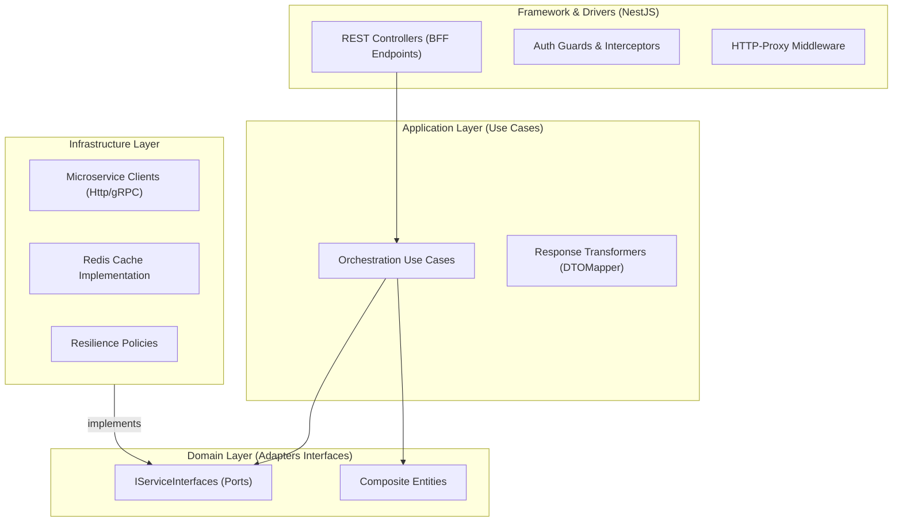
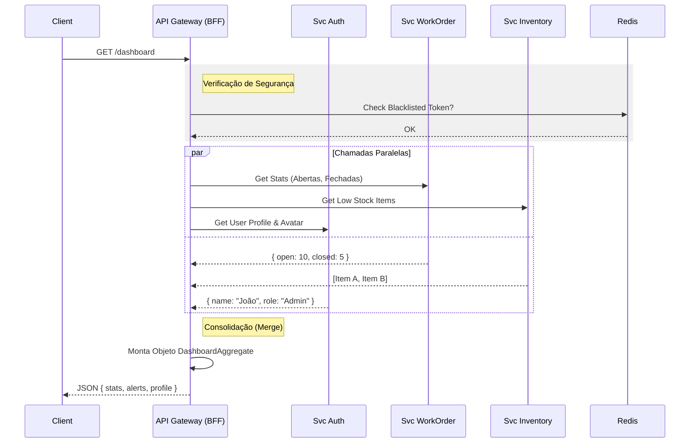
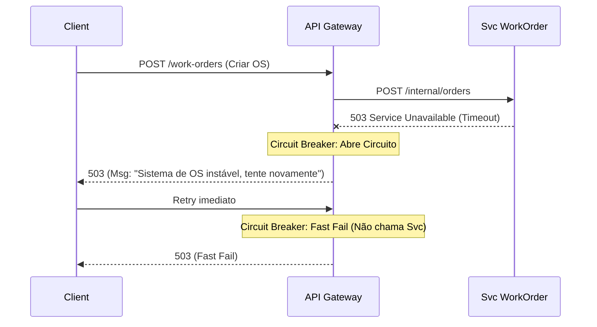

Aqui está a documentação de arquitetura detalhada para o `api-gateway`.

Neste contexto, o **NestJS** atua como um **BFF (Backend for Frontend)**. Diferente de um Proxy reverso simples (como Nginx), este Gateway possui lógica de orquestração, agregação de dados e adaptação de respostas para o cliente.

---

### 📂 File: `1_estrutura_gateway.md`

```markdown
# Estrutura de Pastas e Arquitetura (API Gateway / BFF)

## Visão Geral
O API Gateway segue a **Clean Architecture** para garantir que a lógica de orquestração (Use Cases) não fique acoplada à forma como nos comunicamos com os microserviços (HTTP/gRPC/Kafka).

### Diagrama de Camadas



### Estrutura de Diretórios

A estrutura foca em módulos por funcionalidade do BFF (ex: Dashboard), não necessariamente espelhando 1:1 os microserviços.

```text
/src
├── /app                   # Configuração do NestJS (Modules, Middlewares)
├── /core                  # CAMADA DE DOMÍNIO DO BFF
│   ├── /domain
│   │   ├── /aggregates    # Objetos compostos (ex: DashboardData)
│   │   ├── /value-objects # VOs de apresentação (ex: FormattedCurrency)
│   │   └── /ports         # Interfaces para chamar microserviços (IServiceAdapter)
│   └── /use-cases         # Lógica de Agregação (ex: GetDashboardOverview)
├── /infra                 # IMPLEMENTAÇÃO TÉCNICA
│   ├── /http-client       # Configuração do Axios/gRPC
│   ├── /adapters          # Implementação dos Ports (ex: WorkOrderServiceAdapter)
│   ├── /cache             # Estratégias de Cache (Redis)
│   └── /observability     # Logging e Tracing (OpenTelemetry)
└── /interfaces            # PONTOS DE ENTRADA
    ├── /rest              # Controllers HTTP
    ├── /graphql           # Resolvers (se houver)
    └── /websockets        # Gateways para Realtime

```

```

---

### 📂 File: `2_ddd_bff_elements.md`

```markdown
# Domain Driven Design no BFF

No contexto de um API Gateway/BFF, o "Domínio" não são as regras de negócio core (como calcular impostos), mas sim a **Composição e Apresentação** dos dados.

## 1. Agregados (Composite Aggregates)
São estruturas de dados ricas que combinam informações de múltiplos microserviços para entregar tudo o que uma tela precisa em uma única requisição.

* **DashboardAggregate:**
    * *Responsabilidade:* Alimentar a tela inicial do mecânico.
    * *Composição:*
        * `UserSummary` (Vindo do Auth Service)
        * `WorkOrderStats` (Vindo do WorkOrder Service)
        * `LowStockAlerts` (Vindo do Inventory Service)
        * `Notifications` (Vindo do Notification Service)

## 2. Entidades (BFF Entities)
Objetos que possuem identidade dentro da sessão do usuário ou contexto da requisição.

* **SessionContext:** Mantém os dados do usuário logado, permissões (Claims) e Tenant ID, enriquecidos após a validação do token JWT.

## 3. Value Objects (Presentation VOs)
Objetos imutáveis formatados para consumo do Frontend.

* **UISatusColor:** Mapeia o status técnico (`IN_PROGRESS`) para a cor do badge na UI (`#blue-500`) e texto amigável (`Em Andamento`).
* **MaskedDocument:** CPF ou CNPJ mascarado para exibição segura.

## 4. Event Driven (BFF Side)
O Gateway atua tanto como produtor quanto consumidor (para invalidar caches ou push notifications).

* **Server-Sent Events (SSE):** O Gateway assina tópicos do Kafka (ex: `OS_UPDATED`) e repassa para o Frontend via SSE/WebSocket para atualização em tempo real.

```

---

### 📂 File: `3_adapters_datasources.md`

```markdown
# Repositórios e Adaptadores (Service Proxies)

No Gateway, não acessamos Banco de Dados diretamente. Nossos "Repositórios" são adaptadores que comunicam com os Microserviços via HTTP (REST) ou gRPC.

## Padrão Adapter (Anti-Corruption Layer)
Protege o BFF de mudanças nas APIs dos microserviços. Se a API do microserviço mudar, alteramos apenas o adaptador, não o Use Case.

### Interface (Port - Core Layer)
```typescript
// core/domain/ports/IWorkOrderService.ts
export interface IWorkOrderService {
  getRecentOrders(tenantId: string, limit: number): Promise<WorkOrderSummary[]>;
  createOrder(data: CreateOrderInput): Promise<string>; // Retorna UUID
}

```

### Implementação (Adapter - Infra Layer)

Usa **Circuit Breaker** para evitar falhas em cascata.

```typescript
// infra/adapters/HttpWorkOrderService.ts
@Injectable()
export class HttpWorkOrderService implements IWorkOrderService {
  constructor(private http: HttpService) {}

  @UseCircuitBreaker({ failures: 3, timeout: 1000 })
  async getRecentOrders(tenantId: string, limit: number): Promise<WorkOrderSummary[]> {
    const response = await this.http.get(
      `${process.env.SVC_WO_URL}/orders?limit=${limit}`,
      { headers: { 'X-Tenant-ID': tenantId } }
    );
    return response.data.map(mapToSummary);
  }
}

```

## Data Sources

1. **Microserviços Upstream:** Fonte da verdade.
2. **Redis (Cache):** Armazena agregações pesadas (ex: catálogo de produtos) com TTL curto.
3. **Config Service:** Gerencia feature flags e URLs dos serviços.

```

---

### 📂 File: `4_fluxos_gateway.md`

```markdown
# Fluxos Principais (Orquestração)

## Fluxo 1: Agregação de Dashboard (BFF Pattern)
Este fluxo mostra como o Gateway chama múltiplos serviços em paralelo para montar uma resposta rápida.



## Fluxo 2: Ingestão de Comando com Falha (Circuit Breaker)

Como o Gateway lida quando um microserviço está fora do ar.



```

```
