Aqui está a documentação de arquitetura detalhada para o microserviço `svc-auth`, responsável pela Identidade e Gestão de Acesso (IAM) do ecossistema SaaS.

---

### 📂 File: `1_estrutura_svc_auth.md`

```markdown
# Estrutura de Pastas e Arquitetura (svc-auth)

## Visão Geral
Este microserviço é crítico e isolado. Ele segue estritamente a **Clean Architecture** para garantir que a lógica de criptografia, geração de tokens e regras de acesso não se misturem com frameworks de banco de dados ou HTTP.

### Diagrama de Dependência


### Estrutura de Diretórios

```text
/src
├── /core                  # INDEPENDENTE DE FRAMEWORK
│   ├── /domain
│   │   ├── /entities      # User, Tenant, Role
│   │   ├── /value-objects # Email, Password (hash logic), CNPJ
│   │   ├── /events        # UserRegisteredEvent, TenantCreatedEvent
│   │   └── /exceptions    # Erros de Domínio (ex: InvalidPasswordError)
│   ├── /ports             # Interfaces (IUserRepository, IEncrypter)
│   └── /application       # Casos de Uso (Use Cases)
│       ├── /auth          # Login, RefreshToken, ForgotPassword
│       ├── /user          # CreateUser, UpdateProfile
│       └── /tenant        # CreateTenant, InviteUser
├── /infra                 # CAMADA DE ADAPTADORES (NestJS)
│   ├── /database          # Repositórios concretos (Postgres)
│   │   ├── /mappers       # ORM Entity <-> Domain Entity
│   │   └── /repositories  # TypeOrmUserRepository
│   ├── /cryptography      # Implementação Bcrypt, JWT Strategy
│   ├── /messaging         # Kafka Producer implementation
│   └── /api               # Controllers (HTTP/REST) e gRPC
└── /main.ts               # Entry Point

```

```

---

### 📂 File: `2_ddd_auth_elements.md`

```markdown
# DDD: Agregados, Entidades e Value Objects

A modelagem de identidade foca em segurança e multi-tenancy.

## 1. Agregados (Aggregates)

* **TenantAggregate (Raiz: Tenant):**
    * Representa a oficina/empresa contratante.
    * *Regras:* Um Tenant deve ter pelo menos um usuário "Owner" no momento da criação.
    * *Comportamentos:* `addSubscription()`, `changeStatus(ACTIVE/SUSPENDED)`.

* **UserAggregate (Raiz: User):**
    * O usuário do sistema.
    * *Composição:* `Role` (Cargo), `Credentials` (separado da entidade User por segurança).
    * *Regras:* Um email deve ser único globalmente (ou por Tenant, dependendo da estratégia).
    * *Comportamentos:* `changePassword()`, `assignRole()`.

## 2. Value Objects (Objetos de Valor)

* **Email:** Valida formato e normaliza (lowercase).
* **Password:**
    * Não armazena a senha plana.
    * Ao ser criado, recebe a senha plana, mas internamente já converte para Hash.
    * Possui método `compare(plainText): boolean`.
* **CPF/CNPJ:** Lógica de validação de documentos brasileiros.
* **UserRole:** Enum (`OWNER`, `MECHANIC`, `RECEPTIONIST`, `ADMIN`).

## 3. Event Driven Design (Domain Events)

Eventos disparados pelo `svc-auth` que interessam a outros serviços:

* `UserRegistered`: Interessante para o *svc-notification* enviar email de boas-vindas.
* `TenantCreated`: Interessante para *svc-work-order* e *svc-inventory* provisionarem recursos iniciais se necessário.
* `UserDeleted`: Comanda a exclusão/anomização de dados em outros serviços (GDPR/LGPD).

```

---

### 📂 File: `3_repos_datasources.md`

```markdown
# Repositórios e Data Sources

O serviço de autenticação exige alta consistência (ACID) e performance de leitura para validação de tokens.

## Contratos (Ports)
Definidos na camada `Core`, sem dependência de bibliotecas.

```typescript
// core/ports/IUserRepository.ts
export interface IUserRepository {
  findByEmail(email: string): Promise<User | null>;
  save(user: User): Promise<void>;
  update(user: User): Promise<void>;
}

// core/ports/ITokenService.ts (Abstração JWT)
export interface ITokenService {
  sign(payload: object): string;
  verify(token: string): object;
}

```

## Data Sources & Implementação

1. **PostgreSQL (Principal):**
* Armazena `users`, `tenants`, `roles`, `permissions`.
* Uso de índices em `email` e `tenant_id`.


2. **Redis (Cache & Sessão):**
* **Refresh Tokens:** Armazenamento de Refresh Tokens com TTL (Time To Live).
* **Blocklist:** Armazena tokens JWT revogados antes da expiração (Logout forçado).
* **Rate Limiting:** Controle de tentativas de login falhas para evitar Brute Force.


3. **Kafka (Event Bus):**
* Canal de saída para notificar o sistema sobre novos cadastros.


```

---

### 📂 File: `4_historias_usuario.md`

```markdown
# Histórias de Usuário (IAM)

## Épico: Onboarding de Oficina (Tenant)
### US01 - Cadastro de Empresa
**Como** dono de oficina,
**Quero** registrar minha empresa informando CNPJ e criar meu usuário administrativo,
**Para** começar a usar o sistema SaaS.

## Épico: Gestão de Acesso
### US02 - Login Seguro
**Como** usuário do sistema,
**Quero** fazer login com email e senha e receber um token de acesso,
**Para** acessar as funcionalidades protegidas.

### US03 - Convite de Colaborador
**Como** Administrador (Owner),
**Quero** convidar um mecânico por email para se juntar à minha oficina,
**Para** que ele tenha seu próprio acesso restrito.

### US04 - Recuperação de Senha
**Como** usuário que esqueceu a senha,
**Quero** receber um link único temporário por email,
**Para** redefinir minha credencial de acesso.

```

---

### 📂 File: `5_fluxos_svc_auth.md`

```markdown
# Fluxos Principais

## Fluxo 1: Autenticação (Login) com Refresh Token
Este fluxo garante segurança e renovação de sessão sem forçar logout constante.


## Fluxo 2: Criação de Tenant (Transacional)

Cria a organização e o primeiro usuário (Admin) atomicamente.

```mermaid
sequenceDiagram
    participant API
    participant UC as CreateTenantUseCase
    participant RepoT as TenantRepository
    participant RepoU as UserRepository
    participant Bus as KafkaProducer

    API->>UC: execute(companyData, adminData)
    
    Note right of UC: Inicia Transação DB
    
    UC->>RepoT: save(new Tenant)
    RepoT-->>UC: tenant_id
    
    UC->>UC: Cria User Admin vinculado ao tenant_id
    UC->>RepoU: save(new User)
    
    Note right of UC: Commit Transação
    
    UC->>Bus: Publish "TenantCreated"
    UC->>Bus: Publish "UserRegistered"
    
    UC-->>API: Success (201 Created)

```



```

```
