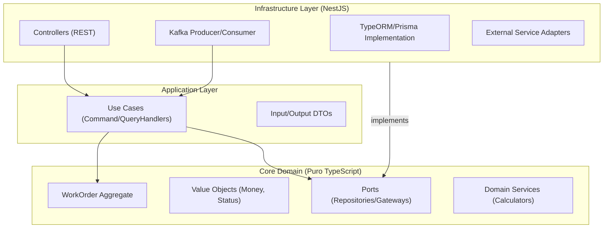
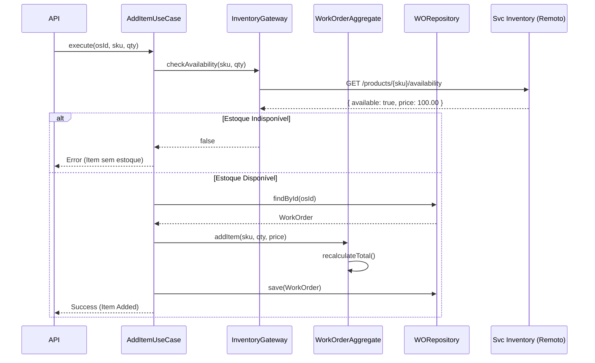
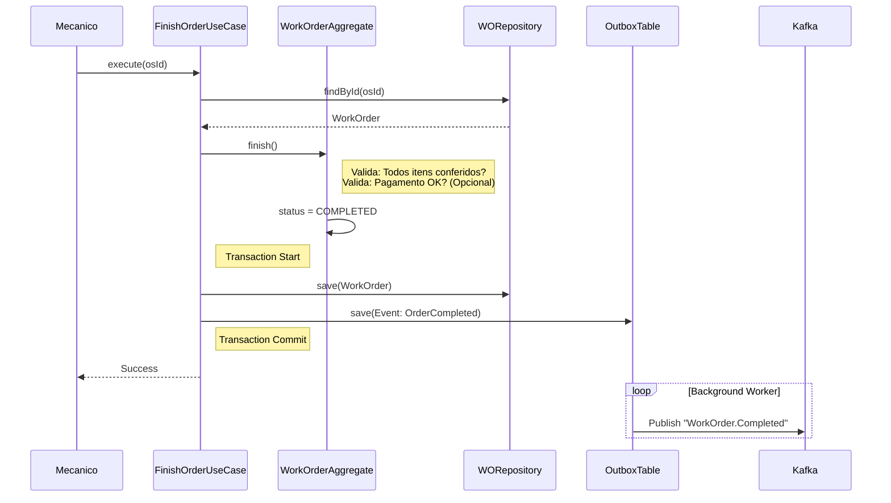

Aqui está a documentação de arquitetura detalhada para o microserviço `svc-work-order`. Este é o **Core Domain** (Domínio Principal) do sistema, onde reside a maior parte da complexidade de negócio da oficina.

---

### 📂 File: `1_estrutura_svc_work_order.md`

```markdown
# Estrutura de Pastas e Arquitetura (svc-work-order)

## Visão Geral
Este serviço gerencia o ciclo de vida das Ordens de Serviço. Devido à alta complexidade de estados e cálculos financeiros, aplicamos **Clean Architecture** rigorosa para isolar as regras de negócio de frameworks e bibliotecas externas.

### Diagrama de Componentes



### Estrutura de Diretórios

Separamos claramente o que é Regra de Negócio (Core) do que é "Mecanismo de Entrega" (Infra).

```text
/src
├── /core                  # DOMÍNIO E APLICAÇÃO (Agnóstico ao NestJS)
│   ├── /domain
│   │   ├── /aggregates    # WorkOrder (Raiz)
│   │   ├── /entities      # OrderItem, PartItem, ServiceItem
│   │   ├── /value-objects # Money, WorkOrderStatus, VehicleSnapshot
│   │   ├── /events        # Domain Events (ex: ItemAdded)
│   │   └── /services      # Domain Services (ex: TaxCalculator)
│   ├── /ports             # Interfaces (IWorkOrderRepository, IInventoryGateway)
│   └── /application       # Use Cases
│       ├── /commands      # CreateWorkOrder, AddItem, ApproveOrder
│       └── /queries       # GetWorkOrderById, ListOrdersByStatus
├── /infra                 # IMPLEMENTAÇÃO TÉCNICA
│   ├── /database          # TypeORM Entities & Repositories
│   ├── /http              # Controllers REST
│   ├── /messaging         # Kafka Controllers (Listeners)
│   └── /adapters          # Comunicação com outros MS (Inventory, Customer)
└── /shared                # Utilitários

```

```

---

### 📂 File: `2_ddd_wo_elements.md`

```markdown
# DDD: Agregados, Entidades e Value Objects

## 1. Agregado Principal: WorkOrder (O.S.)
O Agregado garante a consistência transacional. Nenhuma peça é adicionada sem recalcular o total da O.S.

* **Raiz:** `WorkOrder`
* **Atributos:**
    * `id`: UUID
    * `tenantId`: UUID (Isolamento)
    * `status`: WorkOrderStatus (State Machine)
    * `totalParts`: Money
    * `totalLabor`: Money
    * `totalAmount`: Money (Soma de Parts + Labor)
* **Composição:**
    * `items`: List<WorkOrderItem>
    * `customer`: CustomerSnapshot (VO)
    * `vehicle`: VehicleSnapshot (VO)

## 2. Entidades Internas
* **WorkOrderItem:** Entidade abstrata/polimórfica.
    * **PartItem:** Representa uma peça física. Tem `sku`, `quantity`, `unitPrice`.
    * **ServiceItem:** Representa mão de obra. Tem `serviceType`, `hours`, `hourlyRate`.

## 3. Value Objects (VOs)
* **Money:** Fundamental para evitar erros de ponto flutuante.
    * Propriedades: `amount` (int - centavos), `currency` (BRL).
    * Métodos: `add()`, `subtract()`, `multiply()`, `allocate()`.
* **WorkOrderStatus:** Enum com lógica de transição.
    * Estados: `DRAFT`, `PENDING_APPROVAL`, `APPROVED`, `IN_PROGRESS`, `COMPLETED`, `CANCELED`.
    * Regra: Não pode ir de `DRAFT` direto para `COMPLETED`.
* **VehicleSnapshot:** Cópia imutável dos dados do veículo no momento da criação da O.S. Se o cliente mudar de carro ou placa depois, o histórico da O.S. antiga permanece intacto.

## 4. Event Driven Design (Eventos de Integração)
Eventos públicos que este serviço emite para o barramento (Kafka):

* `WorkOrder.Created`: Notifica Dashboard.
* `WorkOrder.StatusChanged`: Gatilho para notificações (Email/SMS).
* `WorkOrder.Completed`: **Crítico**. Gatilho para o `svc-inventory` baixar o estoque real e `svc-finance` gerar a fatura.

```

---

### 📂 File: `3_repos_datasources.md`

```markdown
# Repositórios e Data Sources

## Interfaces (Ports - Core)
O domínio define como ele quer acessar os dados.

```typescript
// core/ports/IWorkOrderRepository.ts
export interface IWorkOrderRepository {
  save(workOrder: WorkOrder): Promise<void>;
  findById(id: string): Promise<WorkOrder | null>;
  findByVehicle(plate: string): Promise<WorkOrder[]>;
}

// core/ports/IInventoryGateway.ts (ACL)
export interface IInventoryGateway {
  checkAvailability(sku: string, quantity: number): Promise<boolean>;
  reserveStock(sku: string, quantity: number): Promise<void>;
}

```

## Implementação (Infra)

1. **Database Relacional (PostgreSQL):**
* Schema robusto para garantir integridade referencial entre O.S. e Itens.
* Uso de JSONB para armazenar os Snapshots (`customer` e `vehicle`) para evitar JOINS complexos inter-serviços.


2. **Anti-Corruption Layer (ACL):**
* O `InventoryGateway` traduz chamadas de método do domínio em requisições HTTP/gRPC para o `svc-inventory`.


3. **Outbox Pattern (Confiabilidade de Eventos):**
* Para garantir que o evento `WorkOrder.Completed` seja enviado ao Kafka mesmo se o banco cair logo após o commit, salvamos o evento em uma tabela `outbox` no mesmo banco da O.S. e um *worker* lê e publica no Kafka.


```

---

### 📂 File: `4_historias_usuario.md`

```markdown
# Histórias de Usuário (Domínio de O.S.)

## Épico: Operação Diária
### US01 - Diagnóstico Inicial
**Como** mecânico,
**Quero** criar uma O.S. em rascunho e adicionar problemas relatados,
**Para** iniciar a avaliação do veículo.

### US02 - Orçamento
**Como** recepcionista,
**Quero** adicionar peças e serviços à O.S.,
**Para** que o sistema calcule automaticamente o valor total e gere um link de aprovação.

### US03 - Execução
**Como** mecânico,
**Quero** mudar o status da O.S. para "Em Progresso",
**Para** sinalizar que o box está ocupado.

### US04 - Finalização e Garantia
**Como** gerente,
**Quero** finalizar a O.S.,
**Para** que o estoque seja baixado e o histórico do veículo atualizado para fins de garantia futura.

```

---

### 📂 File: `5_fluxos_svc_work_order.md`

```markdown
# Fluxos Principais

## Fluxo 1: Adição de Item com Validação de Estoque (Síncrono)
Embora a baixa de estoque seja assíncrona na finalização, a verificação de disponibilidade deve ser síncrona no orçamento para evitar vender o que não tem.



## Fluxo 2: Finalização da Ordem de Serviço (Core Event Driven)

Este é o fluxo mais crítico, pois dispara efeitos colaterais em outros serviços.



```

```
