Aqui está a documentação de arquitetura detalhada para o microserviço `svc-inventory`, focado na gestão de peças, controle de estoque e fornecedores.

---

### 📂 File: `1_estrutura_svc_inventory.md`

```markdown
# Estrutura de Pastas e Arquitetura (svc-inventory)

## Visão Geral
O serviço de estoque é focado em **Integridade de Dados** e **Controle de Concorrência**. A arquitetura deve prevenir "overselling" (vender o que não tem) e garantir rastreabilidade total (audit trail) de cada parafuso que entra ou sai.

### Diagrama de Camadas


### Estrutura de Diretórios

```text
/src
├── /core                  # LÓGICA DE NEGÓCIO
│   ├── /domain
│   │   ├── /aggregates    # Product (Raiz)
│   │   ├── /entities      # Supplier, StockMovement
│   │   ├── /value-objects # SKU, Money, Quantity
│   │   ├── /events        # LowStockDetected, StockAdjusted
│   │   └── /services      # StockReservationService
│   ├── /ports             # IProductRepository, ISupplierRepository
│   └── /application       # Use Cases
│       ├── /commands      # AdjustStock, RegisterProduct, ConsumeStock
│       └── /queries       # GetProductAvailability
├── /infra                 # IMPLEMENTAÇÃO
│   ├── /database          # TypeORM/Prisma
│   ├── /api               # REST (Gerenciamento)
│   └── /messaging         # Consumers (WorkOrderEvents)
└── /workers               # Jobs (ex: Relatório de Giro de Estoque)

```

```

---

### 📂 File: `2_ddd_inventory_elements.md`

```markdown
# DDD: Agregados, Entidades e Value Objects

## 1. Agregado Principal: Product (Produto/Peça)
Representa o item em estoque. É a raiz de consistência.

* **Raiz:** `Product`
* **Atributos:**
    * `sku`: SKU (Identificador único de negócio).
    * `currentStock`: Quantity (Saldo atual).
    * `reservedStock`: Quantity (Comprometido em O.S. aprovadas, mas não finalizadas).
    * `minStockLevel`: Quantity (Ponto de reabastecimento).
* **Comportamentos:**
    * `addStock(qty, cost)`: Aumenta saldo.
    * `reserve(qty)`: Move do saldo disponível para reservado.
    * `confirmConsumption(qty)`: Remove do reservado (Baixa definitiva).
    * `releaseReservation(qty)`: Devolve do reservado para disponível (Cancelamento de O.S.).

## 2. Entidades de Suporte
* **StockMovement (Imutável):**
    * Histórico financeiro e logístico. Cada `addStock` ou `consume` gera um registro aqui.
    * Atributos: `type` (IN/OUT), `reason` (PURCHASE, WORK_ORDER, LOSS), `referenceId` (ID da O.S. ou Nota Fiscal).
* **Supplier:** Fornecedor da peça.

## 3. Value Objects (VOs)
* **SKU (Stock Keeping Unit):** Garante unicidade e formato (ex: `OIL-FIL-001`).
* **Quantity:** Impede valores negativos. Possui lógica de soma e subtração segura.
* **Dimensions:** Peso e tamanho (para cálculo de frete ou alocação em prateleira).

## 4. Event Driven Design (Domain Events)
Eventos gerados pelo domínio de estoque:

* `Product.LowStockDetected`: Disparado quando `currentStock` < `minStockLevel`. Ouve-se para enviar alerta ao gerente ou sugerir compra automática.
* `Product.PriceChanged`: Atualiza o cache do catálogo no API Gateway.

```

---

### 📂 File: `3_repos_datasources.md`

```markdown
# Repositórios e Data Sources

## Concorrência e Locking
O maior desafio do estoque é a concorrência (duas O.S. tentando reservar a última peça).
Utilizamos **Optimistic Locking** (Versionamento) no banco de dados.

### Interfaces (Ports)
```typescript
interface IProductRepository {
  findBySku(sku: string): Promise<Product>;
  save(product: Product, version: number): Promise<void>; // Falha se versão mudou
}

interface IMovementRepository {
  log(movement: StockMovement): Promise<void>;
}

```

## Data Sources

1. **PostgreSQL (Transactional):**
* Tabelas: `products`, `movements`, `suppliers`.
* Constraint: `check (available_stock >= 0)`. O banco é a última barreira contra estoque negativo.


2. **Redis (Read-Model / Cache):**
* Armazena uma projeção leve do catálogo (`SKU -> { price, available }`).
* Atualizado via evento sempre que o Postgres muda (Pattern: Look-aside ou Write-through).
* Permite que o `svc-work-order` consulte disponibilidade extremamente rápido sem bater no Postgres principal.


3. **Kafka (Input):**
* Tópico: `work-order.events`
* Grupo de Consumo: `inventory-group`


```

---

### 📂 File: `4_historias_usuario.md`

```markdown
# Histórias de Usuário (Estoque)

## Épico: Gestão de Inventário
### US01 - Entrada de Nota Fiscal
**Como** estoquista,
**Quero** registrar a entrada de 50 litros de óleo comprados do fornecedor X,
**Para** que o sistema atualize o saldo e o preço médio de custo.

### US02 - Alerta de Reposição
**Como** gerente de compras,
**Quero** receber uma notificação quando o estoque de pastilhas de freio estiver abaixo de 5 unidades,
**Para** comprar mais antes que acabe.

### US03 - Reserva Automática
**Como** sistema (automático),
**Quero** reservar as peças assim que o cliente aprovar o orçamento,
**Para** garantir que ninguém mais use aquelas peças enquanto o serviço é feito.

### US04 - Auditoria
**Como** auditor,
**Quero** ver o extrato de movimentação de um produto (Kardex),
**Para** saber exatamente em quais Ordens de Serviço a peça foi utilizada.

```

---

### 📂 File: `5_fluxos_svc_inventory.md`

```markdown
# Fluxos Principais

## Fluxo 1: Reserva de Estoque (Reativo a Evento)
Ocorre quando o cliente aprova o orçamento no `svc-work-order`. O estoque deve ser "segurado".


## Fluxo 2: Baixa Definitiva (Consumo)

Ocorre quando a O.S. é finalizada. Move de "Reservado" para "Baixado" e gera log de movimento.

```mermaid
sequenceDiagram
    participant Kafka
    participant Handler as ConsumeStockHandler
    participant RepoP as ProductRepo
    participant RepoM as MovementRepo

    Kafka->>Handler: Consome "WorkOrder.Completed"
    
    note right of Handler: Idempotência: Já processei este EventID?
    
    Handler->>RepoP: findBySku(sku)
    Handler->>Handler: product.confirmConsumption(qty)
    
    Handler->>Handler: Create Movement(Type: OUT, Ref: OS-123)
    
    par Transação DB
        Handler->>RepoP: update(product)
        Handler->>RepoM: save(movement)
    end
    
    Handler-->>Kafka: Ack

```



```

```
