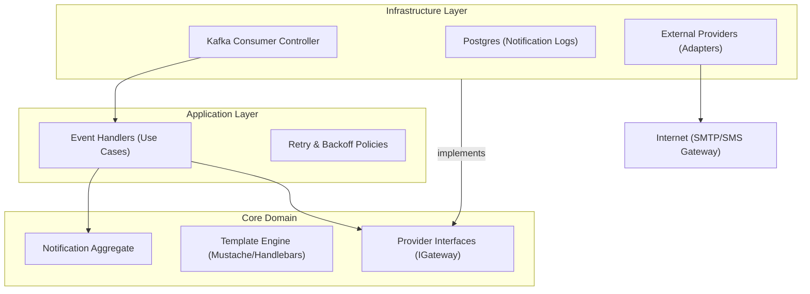
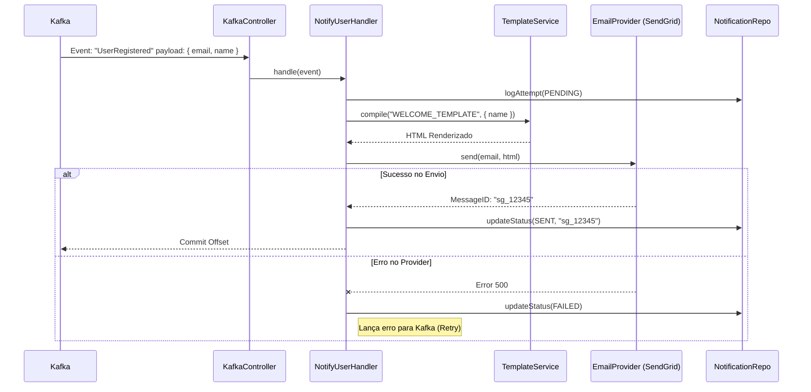
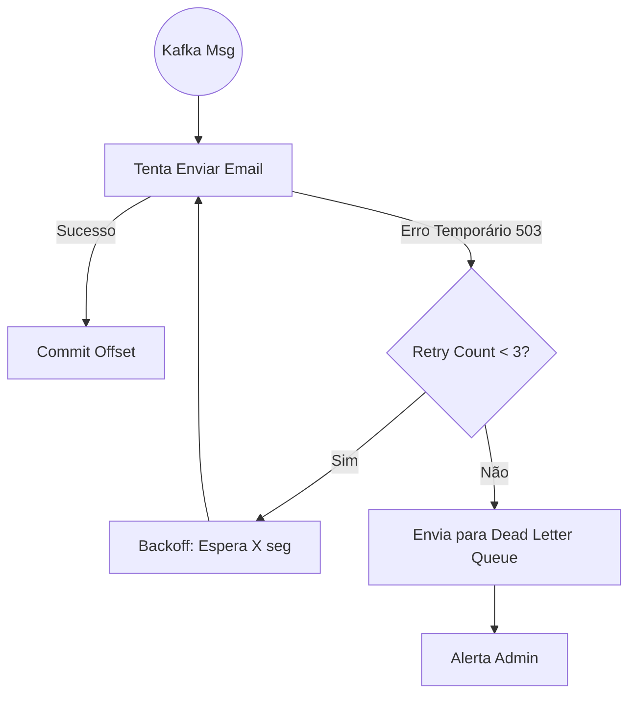

Aqui está a documentação de arquitetura para o microserviço `svc-notification`. Este serviço atua primariamente como um **Sidecar/Consumer**, reagindo a eventos do sistema para engajar usuários fora da plataforma (Email, SMS, Push).

---

### 📂 File: `1_estrutura_svc_notification.md`

```markdown
# Estrutura de Pastas e Arquitetura (svc-notification)

## Visão Geral
Este serviço centraliza a lógica de comunicação. Ele isola os outros microserviços da complexidade de lidar com APIs de terceiros (SendGrid, Twilio, Firebase) e gestão de templates. Segue **Clean Architecture** para permitir a troca fácil de provedores (ex: mudar de AWS SES para Mailgun sem afetar o código de negócio).

### Diagrama de Componentes



### Estrutura de Diretórios

```text
/src
├── /core                  # INDEPENDENTE DE FRAMEWORK
│   ├── /domain
│   │   ├── /aggregates    # Notification (Log & Status)
│   │   ├── /entities      # MessageTemplate
│   │   ├── /value-objects # EmailAddress, PhoneNumber, Priority
│   │   └── /services      # TemplateCompiler (Parser de variaveis)
│   ├── /ports             # IEmailProvider, ISmsProvider, INotificationRepository
│   └── /application       # Casos de Uso
│       ├── /handlers      # SendWelcomeEmail, NotifyOrderStatus
│       └── /commands      # SendGenericNotification
├── /infra                 # ADAPTADORES
│   ├── /database          # Repositório de Logs (Audit)
│   ├── /messaging         # Kafka Consumers (Topics: auth.*, work-order.*)
│   └── /providers         # Implementação concreta
│       ├── /aws-ses       # Adapter para Amazon SES
│       ├── /twilio        # Adapter para SMS/WhatsApp
│       └── /firebase      # Adapter para Push Notifications
└── /config                # Mapeamento Evento -> Template

```

```

---

### 📂 File: `2_ddd_notification_elements.md`

```markdown
# DDD: Agregados, Entidades e Value Objects

## 1. Agregado Principal: NotificationLog
Representa o registro histórico de uma tentativa de comunicação. É crucial para auditoria e debugging ("O cliente diz que não recebeu o email").

* **Raiz:** `Notification`
* **Atributos:**
    * `id`: UUID.
    * `channel`: Enum (`EMAIL`, `SMS`, `WHATSAPP`, `PUSH`).
    * `recipient`: String (Destinatário normalizado).
    * `status`: Enum (`PENDING`, `SENT`, `FAILED`, `BOUNCED`).
    * `providerResponse`: JSON (ID da transação no SendGrid/Twilio).
    * `retryCount`: Number.
* **Comportamentos:**
    * `markAsSent(providerId)`: Atualiza status e data de envio.
    * `markAsFailed(error)`: Registra erro e incrementa retry.

## 2. Entidades de Suporte
* **Template:**
    * Define a estrutura da mensagem. Pode ser armazenado no banco ou em arquivos.
    * Atributos: `key` (ex: `WELCOME_EMAIL`), `subjectTemplate`, `bodyTemplate`, `requiredVariables`.

## 3. Value Objects (VOs)
* **EmailAddress:** Valida Regex de email.
* **PhoneNumber:** Normaliza para E.164 (ex: `+5511999999999`).
* **Content:** Objeto contendo `subject` e `body` já renderizados após a injeção de variáveis.

## 4. Domain Services
* **TemplateEngine:** Serviço puro que recebe um `Template` (ex: "Olá {{name}}") e um `Context` (ex: `{ name: "João" }`) e retorna o texto final.
* **ProviderSelector:** (Opcional) Lógica para escolher provedor mais barato ou "fallback" (se Twilio cair, tenta AWS SNS).

```

---

### 📂 File: `3_repos_datasources.md`

```markdown
# Repositórios e Data Sources

O serviço de notificação é "Stateless" na execução, mas "Stateful" na auditoria.

## Interfaces (Ports)
O Core define **O QUE** precisa ser feito, não **COMO**.

```typescript
// core/ports/IMailGateway.ts
export interface IMailGateway {
  send(to: EmailAddress, subject: string, body: string): Promise<string>; // Retorna Provider ID
}

// core/ports/INotificationRepository.ts
export interface INotificationRepository {
  logAttempt(notification: Notification): Promise<void>;
  updateStatus(id: string, status: NotificationStatus, meta?: any): Promise<void>;
}

```

## Data Sources

1. **Kafka (Source of Truth):**
* O serviço reage a eventos. Não possui API REST para "criar notificação" diretamente (salvo testes). O gatilho é sempre um evento de domínio de outro serviço.


2. **PostgreSQL (Logs):**
* Tabela: `notification_history`.
* Armazena quem recebeu, quando e o conteúdo (se necessário, por questões legais).


3. **Provedores Externos (APIs):**
* AWS SES / SendGrid (Email).
* Twilio / Zenvia (SMS/WhatsApp).
* Firebase FCM (Push Mobile).


```

---

### 📂 File: `4_historias_usuario.md`

```markdown
# Histórias de Usuário (Comunicação)

## Épico: Notificações Transacionais
### US01 - Boas-vindas
**Como** novo usuário,
**Quero** receber um email de boas-vindas ao me cadastrar,
**Para** confirmar que minha conta foi criada corretamente.

### US02 - Status da O.S.
**Como** cliente da oficina,
**Quero** receber um WhatsApp quando meu carro estiver "Pronto",
**Para** que eu possa ir buscá-lo imediatamente.

### US03 - Recuperação de Senha
**Como** usuário,
**Quero** receber um código ou link via email imediatamente,
**Para** redefinir minha senha esquecida.

### US04 - Falha de Envio (Admin)
**Como** administrador do sistema,
**Quero** saber quais emails "bouncaram" (voltaram),
**Para** corrigir cadastros de clientes com emails inválidos.

```

---

### 📂 File: `5_fluxos_svc_notification.md`

```markdown
# Fluxos Principais

## Fluxo 1: Consumo de Evento e Envio (Happy Path)
O fluxo padrão onde um evento de negócio dispara uma notificação.



## Fluxo 2: Retry Pattern (Resiliência)

Como o sistema lida com instabilidades no provedor de email.



```

```
